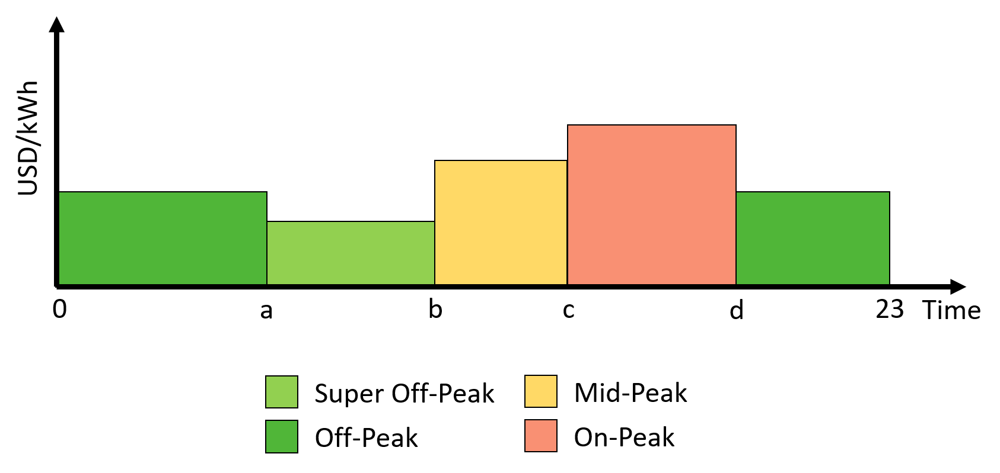

DSM integration into the sizing
==================================

The methodology integrates ToU, CPP, DADP, IBP, Fixed Shape Pricing (FSP) and DLCt as DSM strategies into the sizing of the IMG. The baseline case for comparisons does not use a DSM strategy, it only uses a flat tariff. The description of the baseline case and each of the DSM strategies proceeds in the following subsections [Celik2017]_.

Flat tariff (Baseline case):
--------------------------------
In general terms, the value of a flat tariff is the sum of all the costs of producing the energy divided by the total amount of energy produced [Inversin2000]_. Equation :eq:`equ:8` describes the yearly payments using a regular flat tariff. 

.. math::
    \begin{equation}
        \Gamma_{n}^{flat}=\frac{\zeta_{y}+\vartheta_{y}+\mu_{y}+\phi_{y}}{\sum_{t=1}^T D_{t}^{dr}}(1+R)\sum_{t=1}^T D_{n,t}^{dr}
        % \Theta^{flat}=\frac{\zeta+\sum_{t=1}^T\vartheta_{t}+\sum_{t=1}^T\mu_{t}+\sum_{t=1}^T\phi_{y}}{\sum_{t=1}^T D_{t}^{dr}}(1+R)\sum_{t=1}^TD_{t}^{dr}
    \end{equation}
    :label: equ:8

However, this traditional approach does not set an optimal tariff to recover investments while minimizing energy costs.  Here we propose to introduce a decision variable :math:`\pi^{flat}` into the formulation to find the optimum price for the tariff. 

.. math::
    \begin{equation}
        \Gamma_{n}^{flat}=\pi^{flat}\sum_{t=1}^T D_{n,t}^{dr}
    \end{equation}
    :label: equ:flat

Time of use tariff:
---------------------------

ToU tariffs vary daily or seasonally on a fixed schedule, using two or more constant prices [Baatz2017]_. One of the main benefits of this type of fare is its stability over long periods, which gives the customer a better ability to adapt to it [Glick2014, Kostkova2013]_. To create a ToU tariff, the planner must define the number of :math:`Z` blocks, and the starting and ending hours of each :math:`z` block [Glick2014]_. The optimization problem considers the prices :math:`\pi_z`  of the :math:`Z` number of blocks as decision variables. The following figure shows the main components of a ToU tariff, and equation :eq:`equ:tou` presents the yearly payments using :math:`Z` different block hours of prices. 
 

.. math::
    \begin{equation}
        % \Theta^{ToU}=\sum_{t=1}^T\sum_{z=1}^{Z}\pi_z D_{t}^{dr}
        \Gamma_{n}^{ToU}=\sum_{t=1}^T\sum_{z=1}^{Z}\pi_z D_{z,n,t}^{dr}
    \end{equation}
    :label: equ:tou
 

Critical peak pricing:    
----------------------------

CPP tariff can be 3 to 5 times higher than the usual tariff but is allowed only a few days per year [Kostkova2013]_. In Equation :eq:`equ:11`, :math:`\pi_{base}` is a scalar variable, that is chosen to be equal to the flat tariff :math:`\pi^{flat}`. :math:`\pi_{peak}` is a decision variable of dimension :math:`T`. Equation :eq:`equ:11` defines the day-ahead forecasted payments using a CPP tariff, and Equation :eq:`equ:11a` defines the day-ahead hourly critical peak price.  

.. math::
    \begin{equation}
        \Gamma_{n}^{CPP}=\sum_{t=1}^{T}(\pi^{base}+\pi_{t}^{peak})D_{n,t}^{dr}
    \end{equation}
    :label: equ:11

.. math::
    \begin{equation}
        \pi_{t}^{CPP}=\pi^{base}+\pi_{t}^{peak}
    \end{equation}
    :label: equ:11a

A critical forecasted event as high demand or low generation capacity triggers the critical peak price in a CPP tariff.  In this regard, the CPP tariff must include a predictor of the critical event and a decision mechanism to set the value of the critical price. The formulation uses historical data, which implies that the formulation has full knowledge over the optimization horizon (T\:=\:8760\:hours). The perfect knowledge allows the formulation to state constraint :eq:`equ:12`, limiting the apparition of the critical price only to a few hours in a year. Equation :eq:`equ:12` uses variable :math:`\varphi_{peak}`, to control the number of hours with critical price allowed and :math:`\delta_{peak}` to define how many times the base price :math:`\pi_{base}` is scaled up. The planner defines :math:`\varphi_{peak}` and :math:`\delta_{peak}`. :math:`\pi_{base}`, :math:`\pi_{peak}`, :math:`\tau_{base}` and :math:`\tau_{peak}` are decision variables that the optimization formulation needs to compute. 

.. math::
    \begin{equation}
        \sum_{t=1}^T\pi_{peak,t}\leq \varphi_{peak}T\delta_{peak}\pi_{base}
    \end{equation}
    :label: equ:12

Day ahead dynamic pricing:
-------------------------------
DADP refers to a tariff that is announced one day in advance to customers and has hourly variations. This scheme offers less uncertainty to customers than *hour-ahead pricing* or *real-time pricing,* thus allowing them to plan their activities [Wong2012]_, [Borenstein2002]_. Equation :eq:`equ:13` introduces the payments under DADP tariff, using :math:`\pi_{t}` as a decision variable vector of dimension :math:`T`.

.. math::
    \begin{equation}
        \Gamma_{n}^{DADP}=\sum_{t=1}^T\pi_{t}D_{n,t}^{dr}
    \end{equation}
    :label: equ:13

Incentive-based pricing:
------------------------------
The IBP tariff provides discounts on the tariff to the customers to increase the electric energy consumption or an extra fare to penalize it. The planner can decide the IBP base price to be equal to the flat tariff :math:`\pi^{flat}` to guarantee a constant value each day. Variable :math:`\pi_{inc,t}` computes the hourly incentives and can take positive or negative values. Equation :eq:`equ:6inc` defines the payments using the IBP tariff.

.. math::
    \begin{equation}
        \Gamma_{n}^{IBP}=\sum_{t=1}^{T} D_{n,t}^{dr}(\pi^{base}+\pi_{t}^{inc})
    \end{equation}
    :label: equ:6inc

.. math::
    \begin{equation}
        \pi_{t}^{IBP}=\pi^{base}+\pi_{t}^{inc}
    \end{equation}
    :label: equ:6inca

Fixed Shape Pricing:
------------------------
Dole et al. affirm that tariffs must be simple, transparent, and predictable for the customers [Dole2004]_. By following these recommendations, it is possible to design a pricing scheme that combines the benefits of DADP with the predictability of the ToU tariff. This pricing scheme receives the name of Fixed Shape Pricing (FSP). FSP tariffs can provide more stimulus than the ToU tariff. However, the FSP tariff has the same predictability of the ToU tariff. Although the FSP tariff will not be as simple as the ToU, it will be simpler for the customers than DADP tariffs. 

The FSP tariff fixes one price for each hour over all the days of the year. FSP tariff does not reflect the real costs of producing electricity in the IMG, which is a drawback. However, in the long run, the FSP tariff might offer better results than the ToU pricing. Additionally, it might be easier to accept by the IMG customers than the DADP tariff.

To build the FSP tariff the methodology assigns one variable for each hour of the day. All these variables are one-dimensional. By using these variables the methodology builds a vector of 24 positions, and repeat it till reaching the optimization horizon. The resulting vector is the price of the tariff. Equation :eq:`equ:fsp` shows the payments of the :math:`n` customer when the planner choose to use the FSP tariff as DSM strategy.     

.. math::
    \begin{equation}
        \Gamma_{n}^{FSP}=\sum_{t=1}^{T}\sum_{h=1}^{24}\pi_{h}^{FSP}D_{n,t}^{dr}
    \end{equation}
    :label: equ:fsp

All the tariffs must have restrictions to avoid null or excessive pricing. Governments, policymakers, or IMG owners can guarantee fair fares to the customers with the following constraint:      

.. math::
    \begin{equation}
        \pi^{min} \leq \pi_{x} \leq \pi^{max} 
    \end{equation}
    :label: equ:14

Direct Load Curtailment Strategy:
-------------------------------------

The DLCt strategy curtails a portion :math:`\epsilon_{t}` out of the demand if required. The planner of the IMG decides the percentage of max curtailed hourly demand :math:`\theta`, and the percentage of the total energy curtailed in the optimization period :math:`\kappa`. The final demand and payments are defined as follows: 

.. math::
    \begin{equation}
        D_{t}^{dr}=D_{t}^{flat}-\epsilon_{t}
    \end{equation}
    :label: equ:dlcdem

.. math::
    \begin{equation}
        \Gamma_{n}^{DLCt}=\sum_{t=1}^{T} D_{n,t}^{dr}\pi^{flat}
    \end{equation}
    :label: equ:dlcoay

The general restrictions for the DLCt strategy are defined as follows: 

.. math::
    \begin{equation}
        \epsilon_{t} \leq \theta D_{t}^{dr}
    \end{equation}
    :label: equ:dlcres1

.. math::
    \begin{equation}
        \sum_{t=1}^{T} \epsilon_{t} \leq \kappa \sum_{t=1}^{T} D_{t}^{dr}
    \end{equation}
    :label: equ:dlcres2

It is important to notice that Equation :eq:`equ:6a` establish a constraint to guarantee that the sum of the demand with flat tariff (base case) is equal to the sum of the demand after the application of any of the DSM strategies. However, the DLCt strategy need to violate this constraint, otherwise the only way to guarantee that the base case demand is equal to the demand with DSM is by making the variable :math:`\epsilon_{t}` equal to zero. In order to avoid making :math:`\epsilon_{t}` equal to zero the methodology removes constraint :eq:`equ:6a` for the DLCt DSM strategy.    
